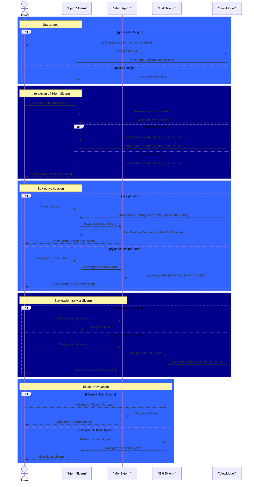
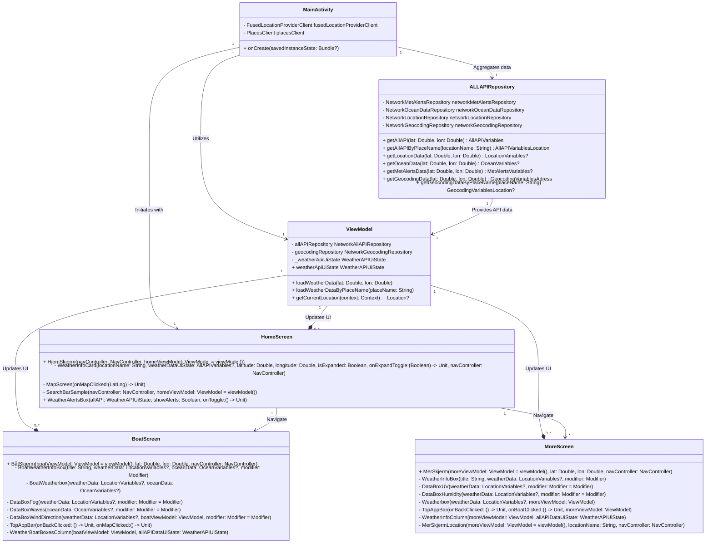
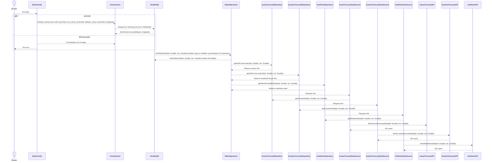

<h2>Flyt diagram</h2>
Dette flytdiagrammet detaljerer hovedfunksjonaliteten til appen, som ved hjelp av ulike skjermer (Hjem Skjerm, Mer Skjerm, Båt Skjerm) og funksjoner for spørring av værdata, håndterer brukernavigasjon og visning av informasjon basert på brukerens valg og interaksjoner.

Detaljer:

Interaksjon på Hjem Skjerm: Når brukeren starter appen, blir en spurt om å tillate posisjonsdeling, videre introduseres Hjem Skjerm hvor brukeren får ett valg om å trykke på ett sted, eller søke det opp. Avhengig av om forespørselen er suksessfull eller ikke, vises værdata eller en feilmelding til brukeren. 

Navigasjon fra Mer Skjerm: På Mer Skjerm har brukeren muligheter for videre navigasjon. De kan enten velge å navigere tilbake til Hjem Skjerm direkte, eller de kan gå videre til Båt Skjerm (hvis tilgjengelig) ved å klikke på båt ikonet. I tillegg får brukeren mulighten å se farevarsler (hvis tilgjengelige for dette stedet).

Tilbake Navigasjon: Brukeren kan også navigere tilbake fra Båt Skjerm til Mer Skjerm ved å klikke på 'Tilbake' knappen. Alternativt kan brukeren fra Båt Skjerm navigere direkte tilbake til Hjem Skjerm ved å klikke på kart ikonet. Dette sender brukeren tilbake til utgangspunktet hvor appen startet.

Samlet gir dette flytdiagrammet en oversiktlig fremstilling av de forskjellige brukerstiene og alternativene som er tilgjengelige i appen, samt hvordan datahåndtering og skjermnavigasjon er interrelatert for å gi en sammenhengende brukeropplevelse.

Flytdiagram av hovedfunksjoanliteten til appen

++++++++++++++++++++++++++++++++++++++++++++++++++++++++++++++++++++++++++++++++++++++
<h2>Sekvens Diagram</h2>
Dette sekvensdiagrammet detaljerer hovedfunksjonaliteten til appen SafeSail, som ved hjelp av ulike skjermer (HomeScreen, MoreScreen, BoatScreen) og en sentral viewModel (ViewModel), håndterer værrelaterte dataspørringer og brukernavigasjon.

Detaljer:

Starter app:

Når man starter appen, så blir man spurt om å gi tillatelse til lokasjonen. Hvis man godkjenner tillatelsen, så vil ViewModel hente den gjeldende lokasjonen til brukeren og sentrere kameraet over brukerens posisjon. Hvis man avviser tillatelsen, så vil kameraet sentreses over Oslo.

Interaksjon på Hjem Skjerm:

Når brukeren trykker på hjemskjermen, skjer en interaksjon hvor ViewModel blir spurt om værdata. Avhengig av om det er et farevarsel så hentes ekstra alerts data, ellers hentes generell værdata.

Søk og Navigasjon:

Brukeren kan søke etter et sted direkte fra HomeScreen eller velge å se mer informasjon, som fører til navigasjon til MoreScreen. På MoreScreen hentes og vises relevant værdata basert på enten spesifikke stedsdata eller data knyttet til det mer detaljerte innholdet brukeren ønsker å utforske.

Navigasjon fra Mer Skjerm:

Brukeren kan navigere fra MoreScreen tilbake til HomeScreen eller videre til BoatScreen. På BoatScreen blir det også hentet inn værdata tilsvarende brukerens geografiske plassering eller valgte lokasjon.

Tilbake Navigasjon:

Brukeren har mulighet til å navigere tilbake fra BoatScreen til MoreScreen eller helt tilbake til HomeScreen, og dette involverer endringer i hva som vises til brukeren basert på skjermen de er navigert til.

---
Sekvensdiagram av hovedfunksjoanliteten til appen

++++++++++++++++++++++++++++++++++++++++++++++++++++++++++++++++++++++++++++++++++++++

<h2>Klasse diagram</h2>
Dette er en beskrivelse av hovedfunksjonaliteten til appen SafeSail, representert gjennom et klassediagram. Appen er strukturert rundt et sentralisert felles repository ved navn ALLAPIRepository, som håndterer samlingen og integrasjonen av data fra forskjellige API-er. App-klassen sender forespørsler om data til forskjellige repositories: LocationRepository, OceanRepository, MetAlertsRepository, og GeocodingRepository.

Dataflyt:   
Data Forespørsel:

MainActivity-klassen initierer dataforespørsler til de nevnte repositories, som hver håndterer API-kall til deres respektive tjenester.
Data Aggregasjon:

Disse repositories sender deretter den innhentede dataen til ALLAPIRepository. Her blir all relevant data aggregeret og konstruert til et format som kan konsumeres av ViewModelen.
Data Bruk:

ALLAPIRepository sender den sammensatte dataen til ViewModel. ViewModel anvender denne dataen gjennom metoden loadWeatherData for å hente og fremstille værinformasjon basert på brukerens geografiske lokasjon eller spesifikke forespørsler.

Visning av Data:

Fra ViewModel blir dataene sendt til ulike skjermer avhengig av brukerinteraksjon:
HomeScreen for generell værinformasjon og gjeldende lokasjon.
MoreScreen for detaljert informasjon og ytterligere værdata.
BoatScreen for spesifikt værrelatert informasjon for maritimt bruk.
Brukerinteraksjon:

Direkte Interaksjon:

Brukeren kan interagere direkte med HomeScreen, MoreScreen, og BoatScreen via trykk som initiere nye dataforespørsler til ViewModel for å oppdatere eller hente mer spesifikk værinformasjon.
Datahåndtering:
Basert på brukerinput eller interaksjoner, vil ViewModel koordinere nye API-kall via ALLAPIRepository for å oppdatere skjermene med ny og relevant informasjon.
Denne strukturen sikrer en robust arkitketur hvor dataflyten er sentralisert og effektiv, skjermvisningene oppdateres dynamisk basert på brukerbehov, og systemet opprettholder en høy grad av modularitet og testbarhet.

Forklaringer:

MainActivity: Starter med å opprette HomeScreen, hente gjeldende lokasjon og bruker ALLAPIRepository for å aggregere data fra flere kilder.

HomeScreen: Brukerens første berøringspunkt hvor hovedvalg vises. Brukeren kan navigere til enten MoreScreen eller BoatScreen basert på valgt lokasjon eller alternativ.

MoreScreen og BoatScreen: Disse skjermene viser henholdsvis mer værrelatert informasjon og maritime forhold basert på den selekterte lokasjonen. De inkluderer funksjonalitet for å navigere tilbake til HomeScreen.

ALLAPIRepository: Sentral lokasjon for å samle og prosessere data fra forskjellige kilder basert på brukervalgt punkt på kartet.

ViewModel: En enkelt ViewModel som håndterer dataleveransen til alle skjermene basert på den valgte lokasjonen, som bygger bro mellom UI og datakilder.

---
Klassediagram av hovedfunksjonaliteten til appen

++++++++++++++++++++++++++++++++++++++++++++++++++++++++++++++++++++++++++++++++++++++
<h2>Use Case Diagram</h2>

Dette er en beskrivelse av hovedfunksjonaliteten til appen SailSafe, representert gjennom to use case-diagrammer. Diagrammene illustrerer hvordan brukere interagerer med systemet og hvordan ulike komponenter og eksterne tjenester samhandler for å levere funksjonalitet.

<h4>Forklaring av funksjonalitet og dataflyt:</h4>
 
**Start interaksjon:** Brukeren kan enten søke etter et sted eller trykke på et spesifikt sted på kartet.  
**Vis data:** Basert på brukerens input, henter systemet data fra Meteorologisk Institutt via api.met og viser relevante data og skjermer.  
**Feilhåndtering:** Hvis det oppstår en feil, vises en feilmelding til brukeren.  
**Farevarsel:** Systemet utvider funksjonaliteten ved behov for å vise farevarsler.  
**Data for båter:** For maritime brukere viser systemet spesifikke data relatert til båter.  

++++++++++++++++++++++++++++++++++++++++++++++++++++++++++++++++++++++++++++++++++++++

<h2>Dataflyt diagram for MVP</h2>
Dette er tegning av dataflyten for vår MVP, Minimum Viable Procuct. Vi har 3 APIer som endepunkter. Videre benytter vi oss av Repositories til disse 3 apiene for å ha mulighet til å hente inn data. Videre blir den dataen send til en felles repository for å gjøre innhenting av data litt enklere. Senere blir dataen sendt til viewmodel og videre blir det displayet på homescreen.

- Api -> DataSource (henter info fra API)
- DataSource -> Repository (Hente data fra datasource til repository)
Repository(Funksjoner til henting ut og bearbeiding av enkeldata fra datasource)
- Repository -> ViewModel
ViewModel(Inneholder funksjoner som kan bli kallt fra Screen)
- ViewModel -> Screen
Screen viser fram composable, og henter funskjoner fra ViewModel

#Dataflyt for MVP

